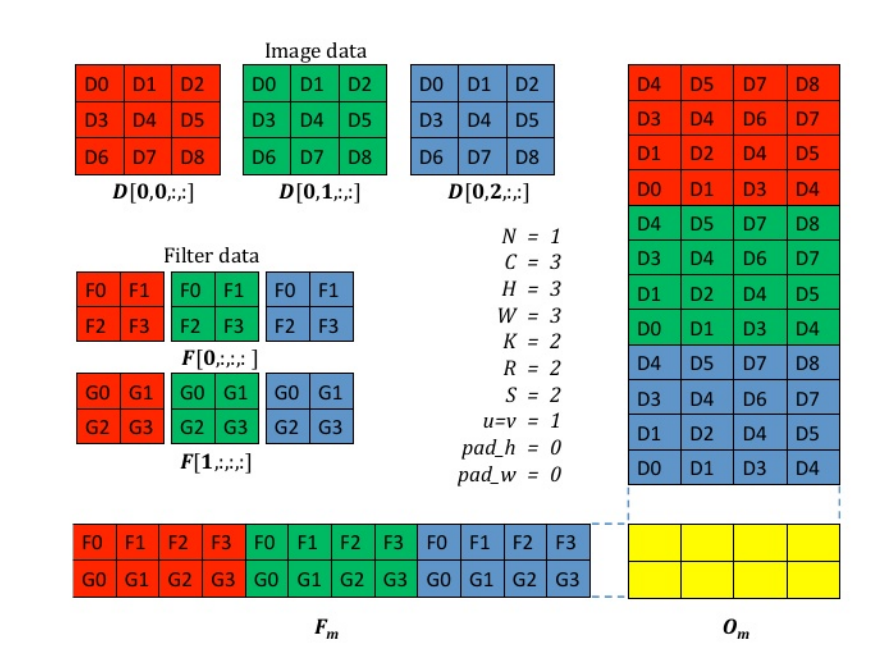

cudnn是如何将加速卷积的
cudnn是cuda的算子库。
cudnn是针对深度学习优化的库，它提供了深度神经网络中常用的操作，如卷积、池化、激活函数等，并且这些操作都是用GPU加速的。
cudnn通过优化卷积算法，减少了计算量，提高了计算速度。具体来说，cudnn使用了多种卷积算法，如im2col算法，Winograd算法、FFT算法等，这些算法在特定情况下可以大大减少计算量，从而提高计算速度。
cudnn还提供了自动选择最优算法的功能，它会根据输入数据的特性和硬件配置，自动选择最优的卷积算法，从而实现最优的性能。

1、im2col算法：
将输入数据展开为列向量，然后进行矩阵乘法运算。这种方法在计算卷积时可以减少内存访问次数，提高计算速度。

具体的展示如上图所示
一般而言输入的形式为NCHW，其中N为batch_size，C为通道数，H为高，W为宽。
而卷积核的形式为KRS，其中K为卷积核大小，R为卷积核高，S为卷积核宽。
于是我们可以将原始输入复制到一个维度为CRS*NPQ的矩阵D中。其中P为输出的高，Q为输出的宽。
将卷积核复制到一个K*CRS的矩阵F中。
然后可以通过成熟的矩阵乘法，得到一个维度为K*NPQ的矩阵O。
最后将矩阵O reshape为K*P*Q，即为卷积的结果。
但是存在的问题有，内存占用大，耗费空间。

